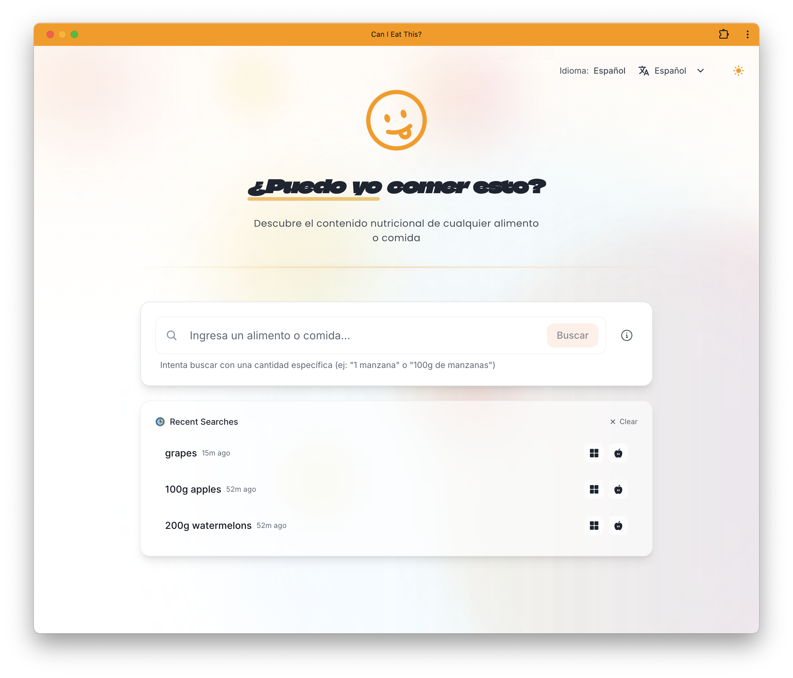
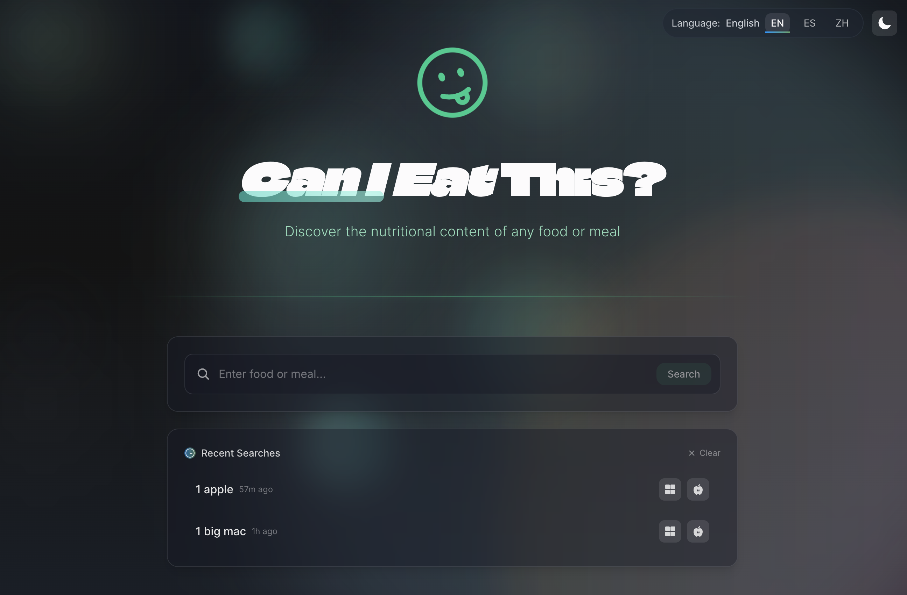
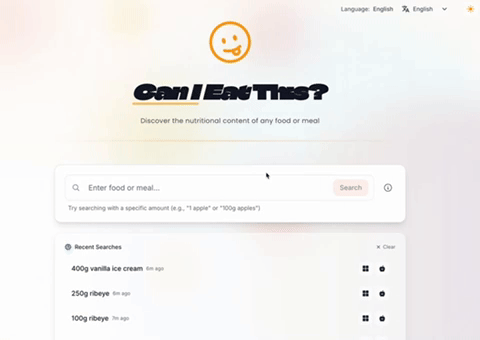

# CanIEatThis?

## Simplifying Dietary Choices for Diabetics

CanIEatThis? is a web application that empowers diabetics to make informed dietary choices through instant nutritional analysis and clear "Yes/No" recommendations. The app is user-friendly and supports multiple languages, making it accessible to non-native English speakers.

---

## Overview

CanIEatThis? simplifies food decisions for diabetics by analyzing the nutritional content of foods and providing personalized recommendations to help them manage their condition better.

---

## Screenshots & Demo

<p align="center">
  
  
</p>
<p align="center">
  
</p>
<p align="center">
  
</p>

---

## Features

- **🔍 Instant Food Analysis:**  
  Provides real-time nutritional breakdown with clear "Yes/No" recommendations for diabetic-friendly choices.

- **📊 Comprehensive Nutritional Data:**  
  Displays key nutritional values such as calories, net carbs, sugars, proteins, fats, and vitamins.

- **🌐 Multilingual Support:**  
  Available in **English**, **Spanish**, and **Chinese**, with seamless language switching.

- **🎨 Modern UI:**  
  Responsive and intuitive design with **dark/light modes**, **animated transitions**, and **interactive elements**.

- **🆕 Enhanced Search Functionality:**  
  The new search bar allows users to input food items and receive detailed nutritional analysis, including error handling and loading states.

---

## Technical Implementation

### Frontend

- Built with **[Next.js 15](https://nextjs.org/)** using **React Server Components**.
- Client-side features include:
  - Theme toggling
  - Internationalization (i18n)
  - Search history management
  - New search functionality with real-time feedback

### Styling & Animations

- **[Tailwind CSS](https://tailwindcss.com/)** for responsive styling, including **dark mode support**.
- **[Framer Motion](https://www.framer.com/motion/)** for smooth animations and micro-interactions to enhance user experience.

### Internationalization

- Implemented using **`next-intl`** for **SEO-friendly routes** and **fallback language support**.

### API Integration

- Uses the **[Edamam Food Database API](https://developer.edamam.com/)** for real-time nutritional analysis and natural language parsing.

---

## Getting Started

### Clone the Repository

```bash
git clone https://github.com/AndrewT-Tran/canieatthisv2
cd canieatthisv2
```

Install Dependencies

```bash
npm install
```

Set Environment Variables

Copy .env.example to .env and add your Edamam API credentials:

```
NEXT_PUBLIC_EDAMAM_APP_ID=your_app_id
NEXT_PUBLIC_EDAMAM_APP_KEY=your_app_key
```

Run the App

```bash
npm run dev
```

Contributing

We welcome contributions to improve CanIEatThis!

Steps to Contribute:

1.  Fork the repository.
2.  Create a feature branch:

```bash
git checkout -b feature/your-feature
```

3. Commit your changes:

```bash
git commit -m "Add your feature"
```

4.  Push your branch and open a Pull Request.

## 📜 License

This project is licensed under the MIT License.
For more details, see the LICENSE file.

## 🙏 Acknowledgments

Special thanks to the following tools and platforms that made this project possible:

- Edamam: For providing a comprehensive nutrition database and API for real-time food analysis.
- Next.js: For offering a powerful framework to build scalable and efficient web applications.
- Tailwind CSS: For simplifying styling with a utility-first CSS framework that supports responsive design and dark mode.
- Framer Motion: For creating smooth and dynamic animations that enhance user experience.
- Iconbuddy: For providing high-quality icons to make the UI visually appealing.

#### Your contributions and continuous improvements to these tools make projects like CanIEatThis? possible. Thank you! 😊
